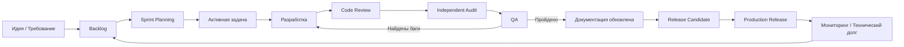
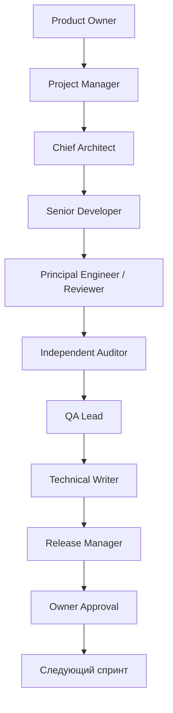

# AI-First Framework для разработки программных проектов

Универсальный шаблон документации, рассчитанный не на людей, а в первую очередь
на несколько ИИ (ChatGPT, Claude, Cursor, Google AI Studio, GitHub Copilot, Codex
и т.д.), работающих над одним проектом как единая распределённая команда.

Подходит для SaaS, Web, Mobile, Desktop, API, CRM, Telegram-ботов и любых других
программных продуктов. Масштабируется от одного разработчика до команды из 20+
человек и произвольного числа параллельно работающих ИИ.

---

## 1. Структура проекта

```
/docs              — фундаментальные документы проекта (контекст, статус, правила)
/ai                — рабочий слой для ИИ: дашборд, workflow, протокол передачи, реестр документов
/prompts           — системные промпты для каждой роли ИИ
/templates         — шаблоны артефактов (задача, баг, фича, ADR и т.д.)
/checklists        — чек-листы для контрольных точек процесса
/reports           — отчёты по факту выполнения (аудиты, code review, QA, security, performance)
/specifications     — технические спецификации (API, БД, интеграции)
/tests             — тестовая документация и test-планы
/releases          — история релизов, changelog, release notes
/scripts           — вспомогательные скрипты автоматизации (обновление дашборда, генерация отчётов)
```

Назначение каждой папки:

| Папка | Назначение | Кто пишет | Как часто меняется |
|---|---|---|---|
| `/docs` | Ядро знаний о проекте: что это, зачем, как устроено, какие правила | PM, Architect, Documentation | Редко / после крупных изменений |
| `/ai` | Оперативный слой для координации ИИ между собой | Все роли, автоматически по возможности | Постоянно, после каждой задачи |
| `/prompts` | Долгоживущие системные промпты ролей | Owner / Control Center | Очень редко |
| `/templates` | Пустые формы для создания новых артефактов | Owner / Documentation | Очень редко |
| `/checklists` | Контрольные списки перед/после этапов | PM / QA | Редко |
| `/reports` | Заполненные отчёты — история фактов | Reviewer, Auditor, QA, Documentation | После каждого события |
| `/specifications` | Точные технические контракты (API, схема БД) | Architect, Developer | По мере развития архитектуры |
| `/tests` | Test-планы, сценарии, покрытие | QA | После изменений функционала |
| `/releases` | CHANGELOG, release notes, версии | Release Manager | При каждом релизе |
| `/scripts` | Автоматизация (генерация дашборда, проверка целостности документации) | Developer / Control Center | По необходимости |

---

## 2. Быстрый вход для нового ИИ

Любой новый ИИ, подключённый к проекту, обязан прочитать документы строго в
этом порядке, прежде чем совершать любое действие:

1. `/docs/AI_CONTEXT.md` — что это за проект и по каким правилам он живёт
2. `/docs/CURRENT_STATUS.md` — что происходит прямо сейчас
3. `/ai/DASHBOARD.md` — метрики готовности и активная задача
4. `/docs/PROJECT_RULES.md` — обязательная «конституция» проекта
5. Промпт своей роли из `/prompts/`
6. Актуальную задачу и связанные с ней документы из `/templates` и `/reports`

Цель — понимание проекта менее чем за 5 минут.

---

## 3. Диаграмма жизненного цикла проекта



## 4. Диаграмма взаимодействия ролей

Подробно — в `/ai/AI_WORKFLOW.md`. Кратко:



---

## 5. Масштабируемость

| Сценарий | Как использовать фреймворк |
|---|---|
| 1 разработчик + 1 ИИ | Роли совмещаются в одном чате/сессии; документы всё равно ведутся, чтобы можно было прерваться и вернуться через месяц без потери контекста |
| Команда 5 человек | Каждая роль — отдельный человек или ИИ-ассистент человека; `/ai/HANDOFF_PROTOCOL.md` становится обязательным на каждом переходе |
| Команда 20+ человек | Добавляются под-дашборды по модулям/командам, `/ai/DASHBOARD.md` становится агрегатором; вводится Control Center как отдельная роль-координатор |
| Несколько ИИ одновременно | Каждый ИИ работает строго в рамках своей роли и своего промпта, не трогает файлы вне зоны ответственности (см. `PROJECT_RULES.md`, раздел «Права доступа»), передача идёт только через `HANDOFF_PROTOCOL.md` |

---

## 6. Связи между документами (карта зависимостей)

```
AI_CONTEXT.md ──────────────┐
                             ▼
PROJECT_RULES.md ───────► все документы обязаны соответствовать
                             │
CURRENT_STATUS.md ◄──────── обновляется после каждого этапа
        │
        ▼
DASHBOARD.md ◄──────────── агрегирует статус, баги, риски, тех.долг
        │
        ▼
AI_WORKFLOW.md ──────────► HANDOFF_PROTOCOL.md ──► reports/*.md
        │                                              │
        ▼                                              ▼
templates/*.md (создание артефактов)      DEFINITION_OF_DONE.md (критерий закрытия)
```

---

## 7. Лучшие практики AI-first разработки

1. Документация первична, код вторичен — если что-то не описано, для ИИ этого не существует.
2. Один источник правды на каждый факт: статус проекта — только в `CURRENT_STATUS.md` и `DASHBOARD.md`, не дублировать по чатам.
3. Явные права доступа — каждый ИИ должен точно знать, какие файлы он может редактировать, а какие нет (см. `PROJECT_RULES.md`).
4. Никогда не передавать задачу с известными ошибками (см. `PROJECT_RULES.md`, раздел 4).
5. Каждый Handoff = отдельная запись в `reports/`, чтобы историю решений можно было восстановить через год.
6. Commit-сообщения и вся документация — на русском языке, простыми словами, понятными через месяцы (см. `GIT_WORKFLOW.md`).
7. Дашборд обновляется после каждой задачи, а не «когда вспомнили».
8. Definition of Done проверяется формально по чек-листу, а не «на глаз».
