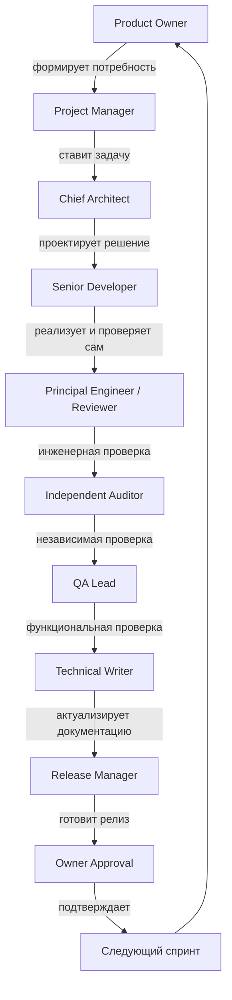

# AI Workflow — Полный цикл работы ИИ

> Обновляет: Control Center / Project Manager.
> Когда обновляется: при изменении процесса.
> Используют: все роли — как карта своего места в процессе.
> Обязателен: да.

## Схема цикла

## Обязанности каждой роли

### Product Owner
Формулирует бизнес-цель, приоритеты, критерии ценности. Утверждает
`PROJECT_RULES.md` и финальное решение о релизе. Не вмешивается в техническую
реализацию.

### Project Manager
Переводит цели в задачи (`templates/task.md`), ведёт `CURRENT_STATUS.md` и
`DASHBOARD.md`, следит за сроками и соответствием ТЗ, разруливает эскалации.

### Chief Architect
Проектирует решение до начала разработки, ведёт `/specifications`, отвечает
за архитектурную целостность и соответствие `AI_CONTEXT.md`.

### Senior Developer
Реализует задачу строго по спецификации, обязан выполнить самопроверку
(`PROJECT_RULES.md`, статья 2) прежде чем передать на Review.

### Principal Engineer / Reviewer
Проверяет инженерное качество кода: читаемость, безопасность, соответствие
стандартам, отсутствие очевидных ошибок. Не является автором изменений.

### Independent Auditor
Проверяет результат независимо от Reviewer — ищет системные риски,
архитектурные нарушения, несоответствие `PROJECT_RULES.md`. Ведёт
`templates/audit.md`.

### QA Lead
Проверяет функциональность с точки зрения пользователя, ведёт test-планы в
`/tests` и `templates/qa_report.md`. Не чинит баги — только фиксирует их.

### Technical Writer
Обновляет `/docs` и `/specifications` под финальное состояние функционала,
следит за `DOCUMENTATION_LIFECYCLE.md`.

### Release Manager
Готовит релиз согласно `GIT_WORKFLOW.md`, заполняет `templates/release.md`,
проверяет план отката.

### Owner Approval
Финальное подтверждение готовности релиза к production со стороны Owner.

### Control Center
Сквозная координирующая роль (актуальна при команде из нескольких ИИ):
маршрутизирует задачи между ролями, поддерживает `DASHBOARD.md` в актуальном
состоянии, следит за соблюдением `HANDOFF_PROTOCOL.md`.

## Правило движения по циклу
Возврат на предыдущий этап (например, из QA обратно в Developer) — это норма,
а не исключение. Каждый такой возврат фиксируется как отдельная запись в
`reports/qa_report_*.md` с указанием причины и связывается с исходной задачей.
