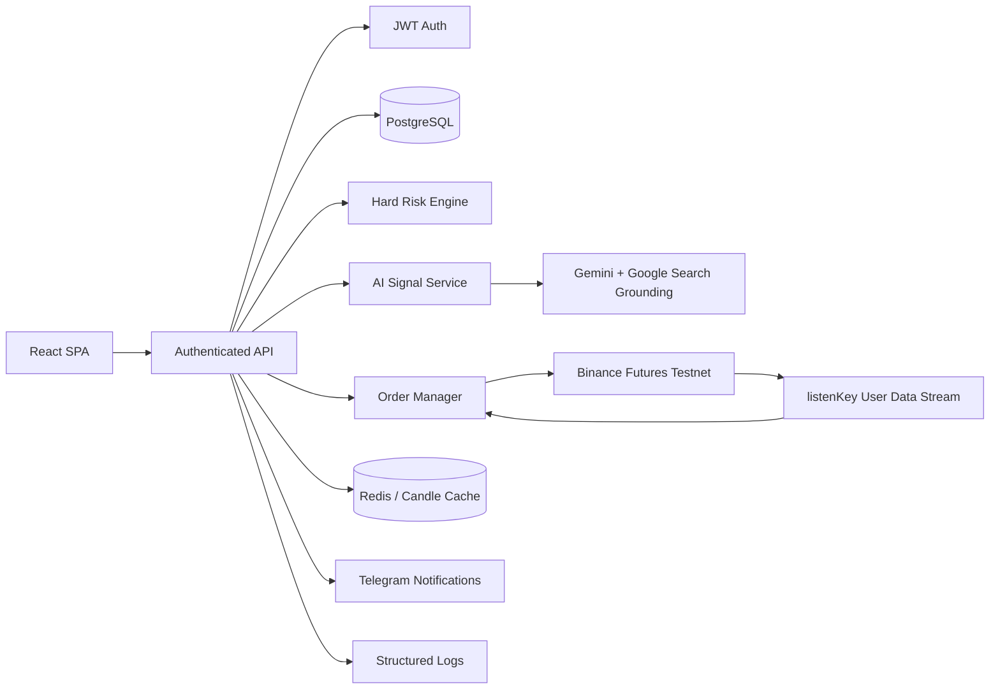

# Current Architecture Specification — SynapseAi

**Дата:** 25.08.2026  
**Статус:** as-is по результатам аудита

## 1. Фактическая архитектура

Тип: монолитный Node/Express + Vite SPA в одном процессе.

```mermaid
flowchart LR
    Browser[React SPA] --> Express[Express server.ts]
    Express --> Gemini[Google Gemini API]
    Express --> BinanceREST[Binance REST API]
    Express --> BinanceWS[Binance Public WebSocket]
    Express --> Telegram[Telegram Bot API]
    BinanceWS --> SSE[/api/binance/stream]
    SSE --> Browser
    Browser --> LocalStorage[(localStorage)]
```

## 2. Компоненты

| Компонент | Файл/папка | Что делает | Риск |
|---|---|---|---|
| Browser/React | `src/App.tsx`, `src/components/*` | Главный UI и trading state | Source of truth на клиенте |
| Initial data | `src/data/initialData.ts` | Mock assets, positions, trades, logs | Demo данные выглядят как реальные |
| Express API | `server.ts` | Все API routes и Vite middleware | Слишком много ответственностей в одном файле |
| Binance REST | `server/binance.ts` | HMAC, klines, depth, orders | Helper, не order manager |
| Binance WS | `server/websocket.ts` | Public ticker -> subscribers | Нет kline/depth/backoff/cache |
| Risk | `server/risk.ts` | Risk validation helpers | Не встроен в order critical path |
| Telegram | `server/telegram.ts` | send/test message | Нет server event bus |

## 3. Хранение данных сейчас

| Данные | Где сейчас | Должно быть по ТЗ |
|---|---|---|
| User | `localStorage.synapse_user` | PostgreSQL `users` + JWT |
| Binance credentials | `localStorage.synapse_binance_config` | PostgreSQL encrypted AES-256-GCM |
| Telegram settings | `localStorage.synapse_telegram_config` | Server-side encrypted/user settings |
| Positions | React state | PostgreSQL `active_positions` |
| Order history | React state | PostgreSQL `order_history` |
| Logs | React state/console | PostgreSQL `system_logs` + structured logs |
| Candles | REST response/client chart | Server memory/Redis cache 500 candles |

## 4. Целевая архитектура по ТЗ



## 5. Главные архитектурные разрывы

1. Source of truth находится на клиенте, а должен быть на сервере/БД.
2. Security boundary отсутствует: клиент владеет Binance secret.
3. Risk boundary отсутствует: order endpoint не принуждает risk validation.
4. Execution boundary отсутствует: AI auto-trade не вызывает backend execution.
5. Integration sync отсутствует: нет `listenKey` private stream.
6. Observability отсутствует: нет structured logs/metrics.
7. Deployment boundary отсутствует: нет Docker/Postgres/Redis.

## 6. Рекомендация по декомпозиции после Этапа 1

После БД/auth/credentials можно разделить `server.ts` на routes/services:

- `server/routes/auth.routes.ts`
- `server/routes/binance.routes.ts`
- `server/routes/risk.routes.ts`
- `server/routes/ai.routes.ts`
- `server/services/credentials.service.ts`
- `server/services/order-manager.service.ts`
- `server/services/risk.service.ts`
- `server/services/market-data.service.ts`
- `server/services/notification.service.ts`
- `server/db/*`

До Этапа 1 крупный рефакторинг не делать: сначала закрыть security foundation.
